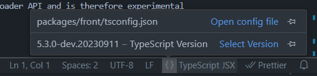
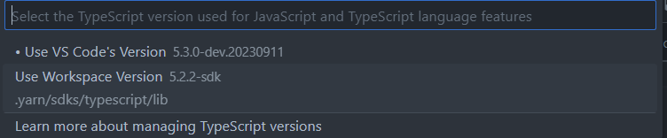

# Yarn berry Monorepo

<br />

> ## 개요
>
> > - 개인이 작업하는 작은 프로젝트나 레포지토리 하나로 관리가 가능하다면 큰 문제는 없다. 하지만 대규모 프로젝트에서라면 수많은 각각의 기능들을 분리하고 몇개이상의 레포지토리에서 관리함으로써 코드가 어떤 레포지토리에 있는 코드를 참조하고 있는지 알기 쉽지 않고, 개발과 프로젝트 관리에 큰 어려움이 있을 수 있다. 이런 문제점을 보완하고자 Monorepo, Monolith, Multirepo라는 기법들이 등장했다.

<br /><br />

> ## Monolith
>
> > - 하나의 레포지토리(코드 베이스)에 수많은 프로젝트를 독립적이지 않게 구분없이 포함시키는 방식이다. 우리가 평소처럼 웹을 개발할때 아무생각 없이 한 프로젝트에 모든 기능 혹은 페이지를 포함시키는 것처럼 한 레포지토리에서 관리하는 프로젝트와 비슷하다고 생각한다

<br /><br />

> ## Multirepo
>
> > - 몇개 이상의 기능 혹은 프로젝트를 각각 한 레포지토리에서 관리하는 방식이다. 다른 레포지토리의 프로젝트를 참조하고 싶을 때 패키징하여 사용할 수 있다.

<br /><br />

> ## Monorepo
>
> > - 각각의 독립적인 프로젝트들을 하나의 레포지토리 안에 묶어서 관리하는 방식이다. 다른 코드의 로직을 참조하고 싶을 때 Multirepo와 같이 패키징 할 필요 없이 바로 참조가 가능하다.
>
> > - 또한 이런 Monorepo 기법에서 가장 중요한 것이 바로 모듈화라고 한다. 독립된 각각의 프로젝트들을 잘 모듈화 함으로써 캡슐화를 이룰 수 있다. 대규모 프로젝트에서 모듈화가 이루어짐으로써 프로젝트 관리가 수월해지고, 소프트웨어 확장 또한 쉬워진다고 한다. 이런 장점들이 나에겐 너무 매력적으로 느껴져 이렇게 Monorepo를 주제로 프로젝트 예시를 작성하게 되었다.

<br /><br />

> # Yarn 모든 workspace의 모듈들을 관리하고 설치할 코드 베이스 만들기
>
> 터미널에 <code>yarn init -y</code>를 입력하면 package.json 파일이 하나 생성될 것이다. 그리고 아래와 같이 private 키를 추가해준다. main 키는 지워줘도 무방하다.

```
  {
      "name": "monorepo-yarn",
      "main": "index.js",
      "version": "1.0.0",
      "private": "true",
      "license": "MIT",
      "packageManager": "yarn@3.6.3",
  }
```

> 그리고 yarn berry를 사용하기 위해 <code>yarn set version berry</code>를 입력하여 설정한다. 그리고 yarn berry에서 가장 핵심이라고 할 수 있는 pnp 설정을 해준다. <code>nodeLinker: pnp</code>
>
> <br />
>
> 그런다음 터미널에 <code>yarn install</code>을 입력하면 모든 workspace의 모듈들을 설치하고 관리할 코드 베이스가 완성된다.
> <br />
>
> # workspace 만들기
>
> 이제 workspace를 만들기 위해 아래와 같이 workspaces 키의 packages를 설정하여 packages 폴더안에 있는 모든 폴더가 worspace에 속하게 만든다.

```
    {
      "name": "monorepo-yarn",
      "version": "1.0.0",
      "private": "true",
      "license": "MIT",
      "packageManager": "yarn@3.6.3",
      "workspaces": {
        "packages": [
          "packages/*"
        ]
      }
    }
```

> 터미널에 <code>mkdir packages/common, packages styles</code>를 입력하여 packages 폴더에 common, styles라는 workspace를 만들기 위한 폴더를 생성해준다.
>
> <br />
>
> 그런다음 터미널로 각 workspace 폴더의 dir로 들어가서 <code>yarn init</code>을 입력해준후 아래와 같이 package.json을 수정해준다.

```
    {
        "name": {workspace 이름},
        "version": "1.0.0",
        "description": "",
        "main": {workspace의 시작점이 되는 모듈},
        "license": "ISC",
        "packageManager": "yarn@3.6.3"
    }
```

> 이제 메인 프로젝트를 위한 폴더를 만들기 위해 packages dir에 들어가서 터미널에 <code>yarn create vite front</code>를 입력하여 vite 프로젝트를 생성해준다.
>
> <br />
>
> front 폴더의 dir로 들어가서 <code>yarn install</code>을 입력해 준다. 그러면 front 폴더에 있는 package json에 있는 종속성 키에 포함된 모든 모듈들이 코드 베이스의 .yarn 폴더에 설치될 것이다. 이제 yarn berry monorepo의 모든 기본 셋팅이 끝났다.
>
> <br />
>
> 만약 Typescript를 사용한다면 App.tsx폴더에 들어가면 빨간줄로 도배가 될 수 있다. root dir의 터미널에서<code>yarn add typescript --dev</code>을 입력하여 typescript 설치한 후 <code>yarn dlx @yarnpkg/sdks vscode</code>를 입력한다. 그리고 아래 사진과 같이 Select Version을 클릭하고 Use Workspace Version을 선택하면 해결될 것이다.
>
> <hr />
>
> 
>
> <hr />
>
> 

<br />

# 특정 workspace에 모듈 추가하는 법

```
yarn workspace {workspace 이름} add {설치할 모듈}
```

<br />

# workspace 간 참조하는 법

추가할 workspace의 이름을 package json의 종속성 키에 추가하고 터미널에서 <code>yarn install</code>을 입력하면 참조가 가능하다.

```
"dependencies": {
    {참조할 workspace 이름}: "*",
    "react": "^18.2.0",
    "react-dom": "^18.2.0"
  },
```

그리고 아래와 같은 방식으로 workspace의 특정 모듈을 불러올 수 있다.

```
import 가져올 모듈 from "@monorepo/common/index";
```
